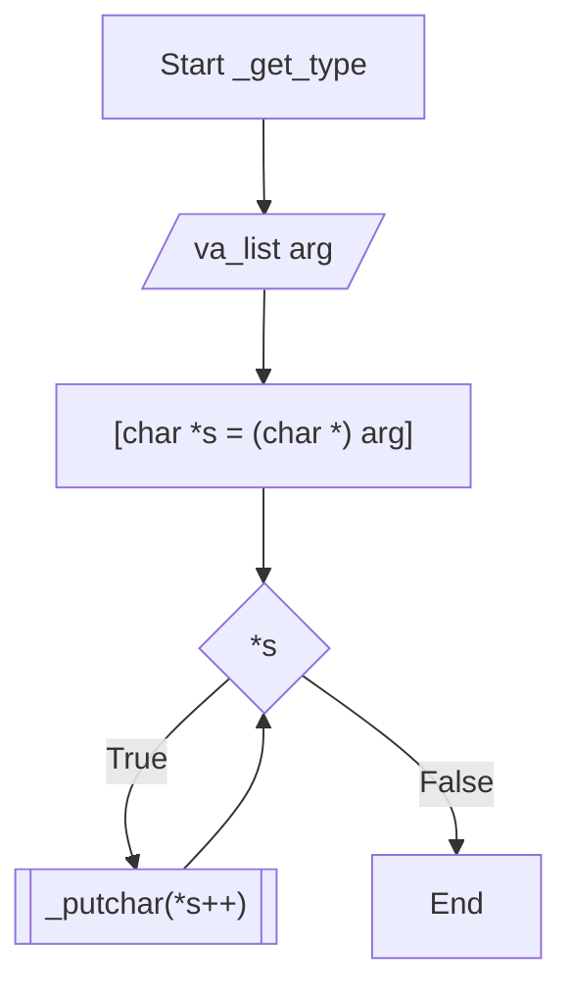

```mermaid

flowchart TD
  start["Start _get_type"] --> args[/"va_list arg"/]
  args --> vars["[char *s = (char *) arg]"]
  vars --> cond1{"*s"}
  cond1 -- True --> func[["_putchar(*s++)"]] 
  func --> cond1
  cond1 -- False --> stop["End"]
```
