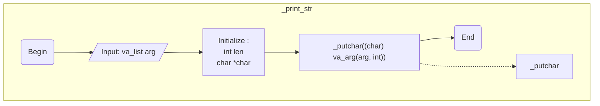

```mermaid
flowchart TD

subgraph _print_str
  start_ps("Begin")
  start_ps --> input_ps[/"Input: va_list arg"/]
  input_ps --> iniz_ps["Initialize :\nint len\nchar *char"]
  iniz_ps --> func_ps["_putchar((char) va_arg(arg, int))"] -..-> _putchar
  func_ps --> stop_ps("End")
end
```
