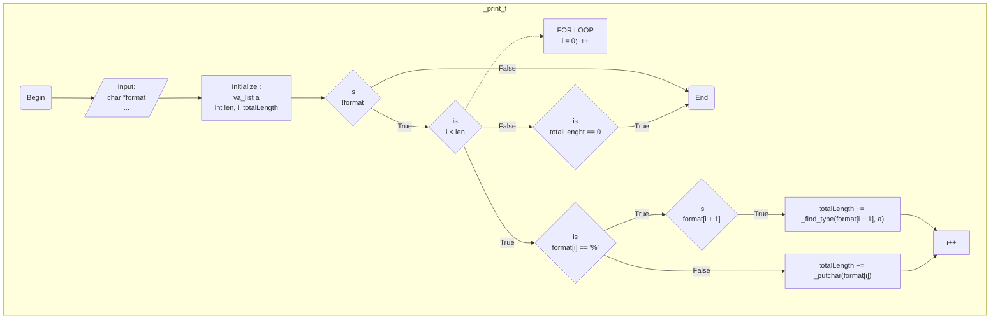

```mermaid
flowchart TD

subgraph _print_f
  start("Begin")
  start --> input[/"Input:\nchar *format\n..."/]
  input --> iniz["Initialize :\nva_list a\n int len, i, totalLength"]
  iniz --> if1{"is \n !format"} -- False --> stop_pf
  if1 -- True --> for1{"is\ni < len"} -.-> forcomment1["FOR LOOP \ni = 0; i++"]
  for1 -- True --> if2{"is \n format[i] == '%'"} -- True --> if3{"is \nformat[i + 1]"} -- True --> func1["totalLength += _find_type(format[i + 1], a)"]
  func1 --> func2["i++"]
  if2 -- False --> func3["totalLength += _putchar(format[i])"] --> func2
  for1 -- False --> if4{"is\n totalLenght == 0"} -- True --> stop_pf
  stop_pf("End ")
end


```
