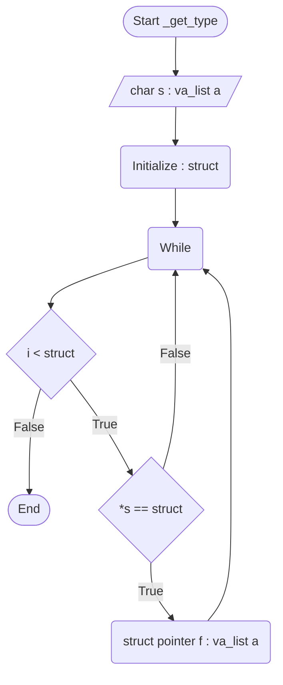

```mermaid
graph TD
  start([Start _get_type])
  va_arg[/char s : va_list a/]
  struct(Initialize : struct )
  while(While)
  i_inf_struct{i < struct}
  fin([End])
  while-->i_inf_struct
  i_inf_struct-- False -->fin
  i_inf_struct-- True -->char_s_egual_struct
  char_s_egual_struct{*s == struct}
  
  action(struct pointer f : va_list a)
  char_s_egual_struct-- False -->while
  char_s_egual_struct-- True -->action
  action-->while
  
  
  start-->va_arg
  va_arg-->struct
  struct-->while
```
