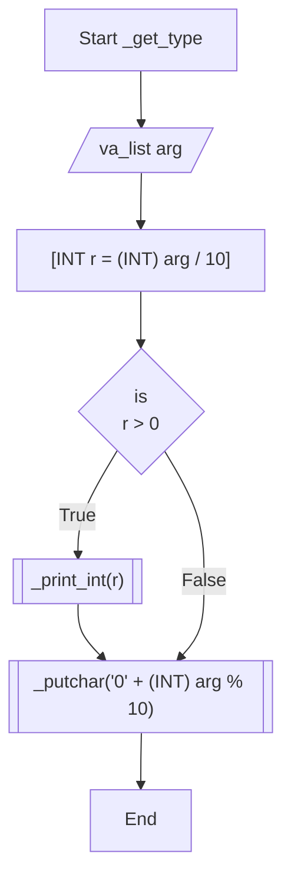

```mermaid

flowchart TD
  start["Start _get_type"] --> args[/"va_list arg"/]
  args --> vars["[INT r = (INT) arg / 10]"]
  vars --> cond1{"is \nr > 0"}
  cond1 -- True --> id1[["_print_int(r)"]]
  id1 --> func[["_putchar('0' + (INT) arg % 10)"]]
  func --> stop["End"]
  cond1 -- False --> func
```
